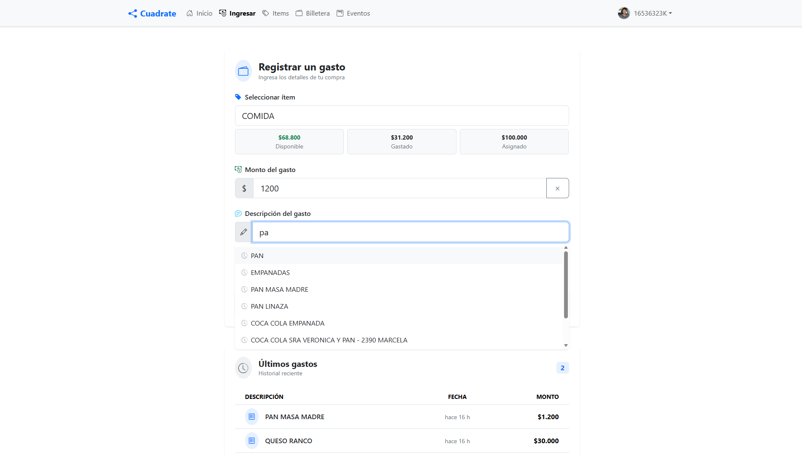
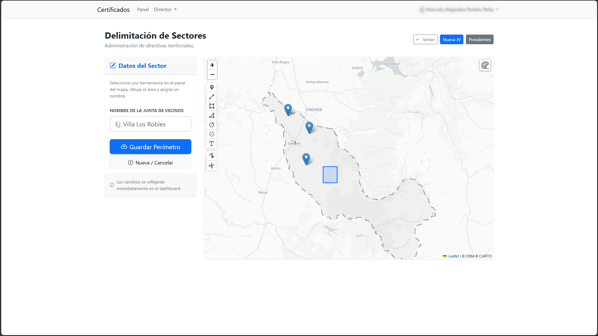
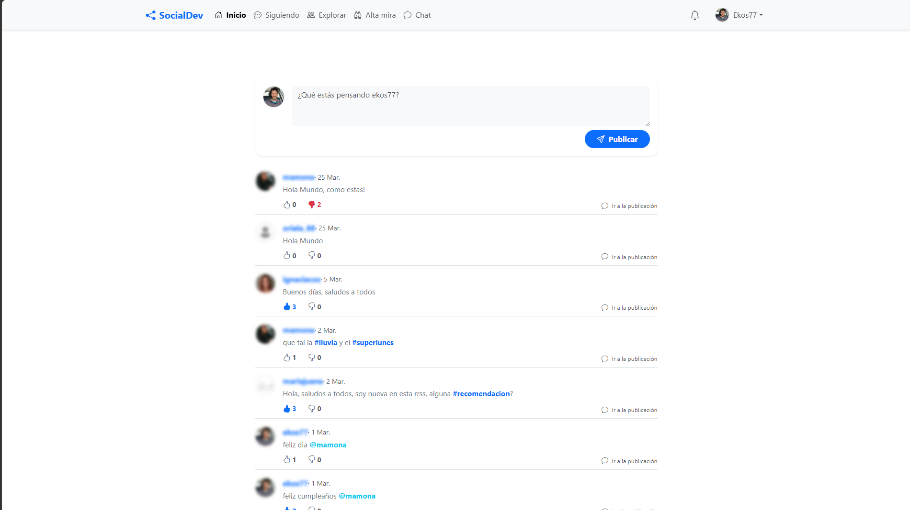

# 🌐 Ecosistema de Soluciones Tecnológicas
## Claudio Seguel A. | Ingeniero en Informática

---

### 🧑‍💻 Perfil Profesional

Ingeniero en Informática con más de **6 años de trayectoria** liderando procesos de transformación digital en los sectores de **Educación** y **Salud Pública**. Especialista en el desarrollo de sistemas modulares, automatización de flujos de trabajo e integración de estándares estatales.

Mi enfoque combina la eficiencia técnica con el cumplimiento normativo (**Ley 19.628 de Protección de Datos**), asegurando soluciones escalables, seguras y con alto impacto territorial en la Región del Maule.

---

### 🚀 Proyectos y Aplicaciones Destacadas

| Proyecto | Descripción | Estado / Enlace |
| :--- | :--- | :--- |
| 🏘️ **SIMU** | **Sistema Informático Municipal.** Gestión de incidencias y vinculación entre Juntas de Vecinos y Administración Pública. | `Propiedad Privada` |
| 🩺 **Sistema IPAE** | Gestión de **Idoneidad Psicolaboral** para el Servicio de Salud Maule. Optimización de procesos para asistentes de la educación. | `En Producción (Gob)` |
| 🛡️ **Gestión de Decomiso** | Implementación y adaptación regional del sistema de gestión para el Servicio de Salud Maule. Optimización de flujos fiscales y coordinación de servicios de salud regionales. | `En Producción (Gob)` |

| ⚙️ **API Gateway SSMaule** | Desarrollo e implementación de servicios web (API) para la integración y sincronización de datos entre plataformas del Servicio de Salud Maule. | `En Producción (Gob)` |

| 💰 **Cuadrate** | Gestión financiera inteligente para estudiantes y profesionales. Control de presupuestos y flujos de caja. | [🔗 Ver Demo](https://www.claudiodev.cl/presupuesto2/) |
| 🚗 **Estacionamientos** | Sistema modular para el control de acceso y gestión económica de aparcamientos. | `Propiedad Privada` |
| 🌐 **RRSS Corporativa** | Red social de entorno empresarial diseñada para mejorar la comunicación interna, el intercambio de conocimientos y la colaboración modular entre equipos de trabajo. | `Propiedad Privada` |
| 🚌 **Geobus** | Sistema de gestión logística para transporte escolar masivo. Incluye geolocalización en tiempo real, optimización de rutas y notificaciones de proximidad. | `Propiedad Privada` |

---

### 🛠️ Stack Tecnológico

#### **Backend & Datos**
- **Lenguajes:** PHP (Laravel/MVC), Python (Flask/FastAPI), SQL.
- **Bases de Datos:** MySQL, PostgreSQL, SQL Server.
- **Análisis:** Pandas, Data Mapping, Web Scraping, R.

#### **Frontend & UI**
- **Frameworks:** JavaScript (Vue 3), Bootstrap 5, Bulma.
- **Visualización:** Chart.js, Leaflet.js (GIS/Mapas).

#### **Infraestructura y Herramientas**
- **Control de Versiones:** Git / GitHub.
- **Automatización:** PowerShell, Power Automate (M365).
- **Entorno:** Linux / Windows Server.

---

### 📘 Galería de Soluciones

> [!IMPORTANT]
> **Nota sobre Privacidad:** Por razones de seguridad y cumplimiento de la Ley 19.628, las capturas de sistemas gubernamentales (como IPAE) han sido omitidas o anonimizadas.

  
📸 Ver Capturas de Pantalla (Click para desplegar)

  #### **Cuadrate / Presupuesto**
  
    
  *Interfaz limpia orientada a la experiencia de usuario (UX).*

  #### **SIMU - Vinculación Vecinal**
  
    
  *Módulo de incidencias ciudadanas y reportabilidad regional.*

  #### **RRSS Corporativa**
  
    
  *Módulo de incidencias ciudadanas y reportabilidad regional.*

---

### 🤝 Contacto y Colaboración

Si buscas un perfil técnico con visión de gestión pública y experiencia en el terreno, hablemos:

- 💼 **LinkedIn:** [Tu Perfil Aquí]
- 📧 **Email:** [seguel.claudio.a@gmail.com](mailto:seguel.claudio.a@gmail.com)
- 🌍 **Web Personal:** [www.claudiodev.cl](https://www.claudiodev.cl)

---
